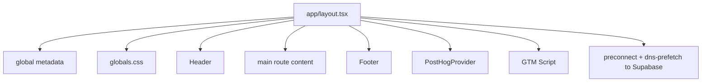
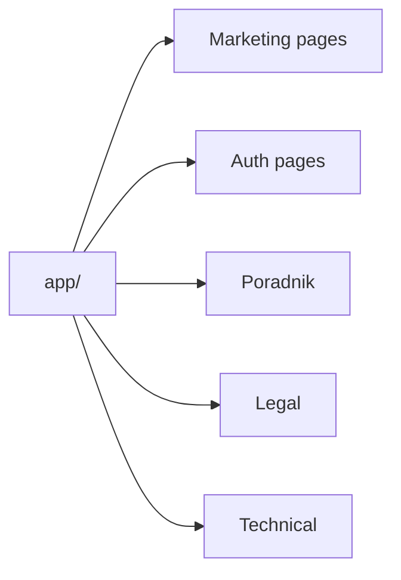
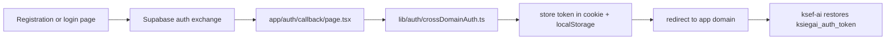
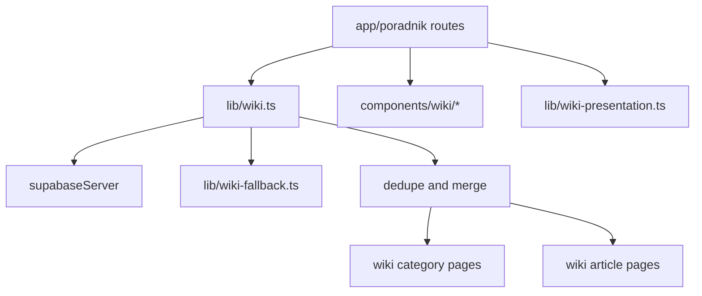
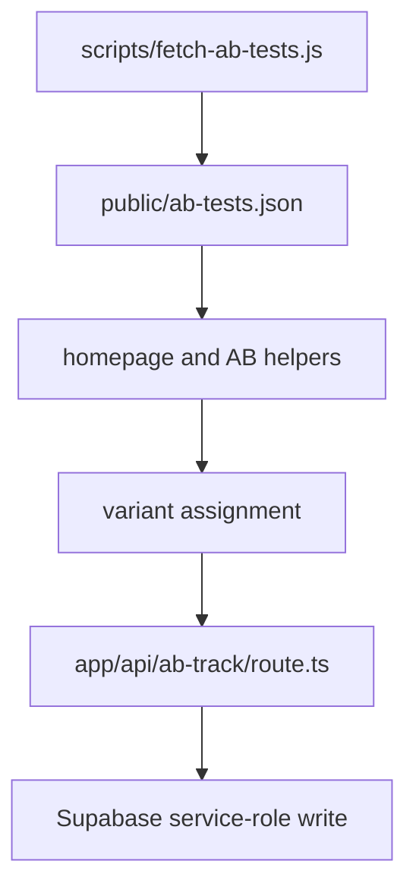
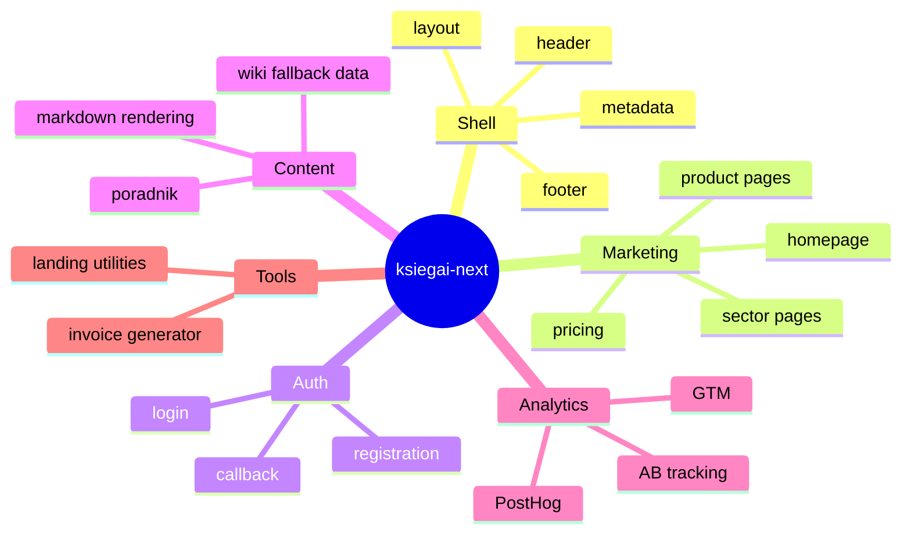
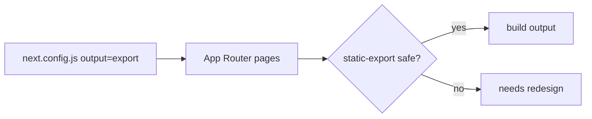
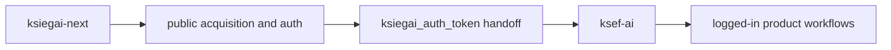

# ksiegai-next Graph Map
Created: 2026-05-24 11:54 CEST
Last modified: 2026-05-24 11:54 CEST

Repo-grounded graph map for the current `ksiegai-next` marketing and auth-handoff app. This focuses on route ownership, auth transfer, content systems, and build-time/static constraints.

## 1. App Shell Graph

Primary shell files:
- `app/layout.tsx`
- `components/Header.tsx`
- `components/Footer.tsx`
- `components/PostHogProvider.tsx`
- `app/globals.css`

Runtime implications:
- all public routes inherit one shell
- SEO defaults start in `app/layout.tsx`
- tracking is globally mounted, with page-level logic layered on top where needed

## 2. Public Route Surface

Observed route families:

- Marketing:
  - `app/page.tsx`
  - `app/cennik`
  - `app/dla-ksiegowych`
  - `app/jak-to-dziala`
  - `app/premium`
  - `app/governance`
  - `app/infrastructure`
  - `app/jdg`
  - `app/spolka-z-oo`
  - `app/ksef`
  - `app/faktury`
- Auth:
  - `app/rejestracja`
  - `app/logowanie`
  - `app/auth/login`
  - `app/auth/callback`
  - `app/auth/confirm`
- Poradnik:
  - `app/poradnik/page.tsx`
  - `app/poradnik/[slug]/page.tsx`
  - `app/poradnik/kategoria/[slug]/page.tsx`
- Legal:
  - `app/regulamin`
  - `app/polityka-prywatnosci`
  - `app/polityka-zwrotow`
  - `app/rodo`
- Technical:
  - `app/api/ab-track/route.ts`
  - `app/robots.ts`
  - `app/sitemap.ts`
  - `app/manifest.ts`

## 3. Auth Handoff Graph

Primary auth files:
- `app/rejestracja/page.tsx`
- `app/logowanie/page.tsx`
- `app/auth/callback/page.tsx`
- `lib/auth/crossDomainAuth.ts`

Contract edges:
- token key must remain `ksiegai_auth_token`
- localhost handoff differs from production handoff
- this repo is the public entry; session continuity completes in `ksef-ai`

## 4. Poradnik / Wiki Graph

Primary content files:
- `lib/wiki.ts`
- `lib/wiki-fallback.ts`
- `lib/wiki-presentation.ts`
- `app/poradnik/page.tsx`
- `app/poradnik/kategoria/[slug]/page.tsx`
- `app/poradnik/[slug]/page.tsx`
- `components/wiki/*`

Current data model in `lib/wiki.ts`:
- categories come from `wiki_categories` filtered to `surfaces = marketing`
- articles come from `wiki_articles` filtered to `status = published` and `surfaces = marketing`
- fallback content is merged in when DB content is missing or incomplete
- category/article lists are de-duped by slug

This is the highest-signal content subsystem in the repo right now.

## 5. AB Testing Graph

Primary AB files:
- `scripts/fetch-ab-tests.js`
- `public/ab-tests.json`
- `app/api/ab-track/route.ts`
- homepage AB helper code under `lib/` and `app/page.tsx`

Observed constraints:
- static payload is prepared before build
- runtime should not move to direct browser DB access
- event tracking route is the backend edge for assignments and events

## 6. Marketing Composition Graph

Key component zones:
- `components/home/*`
- `components/wiki/*`
- `components/invoice-tools/*`
- `lib/home/*`
- `lib/invoice-tools/*`
- `lib/auth/*`

## 7. Static Export Constraint Graph

Why this matters:
- repo uses static export mode
- route additions and feature changes must stay compatible with export constraints
- technical pages like `robots`, `sitemap`, and cached AB payload are part of that contract

## 8. Cross-Repo Relationship

High-signal shared contract:
- `ksiegai-next` owns marketing, SEO, public auth entry, public content
- `ksef-ai` owns the actual app workspace
- auth handoff is the bridge between them

## 9. Start-Here Paths For Agents

If working on:

- site-wide SEO or shell:
  - `app/layout.tsx`
  - `app/robots.ts`
  - `app/sitemap.ts`
- homepage and growth surfaces:
  - `app/page.tsx`
  - `components/home/*`
  - `lib/home/*`
- login / signup / redirect behavior:
  - `app/rejestracja/page.tsx`
  - `app/logowanie/page.tsx`
  - `app/auth/callback/page.tsx`
  - `lib/auth/crossDomainAuth.ts`
- poradnik:
  - `lib/wiki.ts`
  - `lib/wiki-fallback.ts`
  - `lib/wiki-presentation.ts`
  - `app/poradnik/*`
  - `components/wiki/*`
- AB tests:
  - `scripts/fetch-ab-tests.js`
  - `public/ab-tests.json`
  - `app/api/ab-track/route.ts`

## 10. Refresh Triggers

Refresh this graph when any of these change:
- route families under `app/`
- shell ownership in `app/layout.tsx`
- auth callback or token storage contract
- poradnik data source or fallback merge behavior
- AB testing fetch/build/runtime flow
- static export mode or next config constraints
